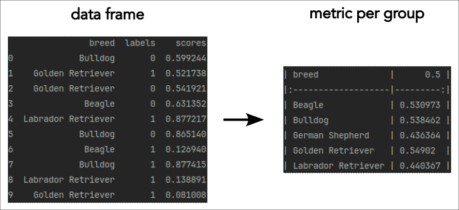

# score-analysis

Package to analyse ML model results. Contains an efficient implementation of common
metrics computations such as TPR, FPR, EER and methods for threshold setting.

Check out the online 
[documentation]().

## Usage

### Terminology

Sometimes, we like to work with metrics based on acceptance and rejection, such as
FAR (false acceptance rate) and FRR (false rejection rate), while the standard ML
terminology talks about positive and negative classes and FPR (false positive rate) and
FNR (false negative rate).

This library adopts the standard ML terminology. The translation is simple: just replace
"accept" with "positive" and replace "reject" with "negative" and you have a dictionary
between the two worlds.

The library is also agnostic to which direction scores are pointing. It works with 
scores that indicate membership of the positive (accept) class as well as with scores
that indicate membership of the negative (reject) class. The score interpretation is
set using the `score_class` parameter when constructing a `Scores` object.

The key is to decouple the process of computing scores from the process of interpreting
them. When we compute scores, e.g., using an ML model, some will point towards genuines,
some towards spoofs/fraud. Sometimes we use score-mappers that reverse the score 
orientation. We cannot change scores. But, when we move towards interpreting them, we
should always use a fixed terminology: positive class means accept/genuine; negative 
class means reject/spoof/fraud. And at the point, when we go from generating scores to
interpreting them, we set, via the `score_class` parameter, how scores are to be 
interpreted.

### Scores

We assume that we work with a binary classification problem. First, we create a `Scores`
object with the experiment results. We can do this in two ways.

```python
from score_analysis import Scores

# If we have the scores for the positive and negative classes separately
scores = Scores(pos=[1, 2, 3], neg=[0.5, 1.5])

# If we have an intermingled set of scores and labels
scores = Scores.from_labels(
    labels=[1, 1, 1, 0, 0],
    scores=[1, 2, 3, 0.5, 1.5], 
    # We specify the label of the positive class. All other labels are assigned to
    # the negative class.
    pos_label=1,  
)
```

There are two parameters, that will determine calculations of metrics:

- Do scores indicate membership of the positive or the negative class (`score_class`)
- If a score is exactly equal to the threshold, will it be assigned to the positive
  or negative class (`equal_class`)

The meaning of the parameters is summarized in the table

| score_class | equal_class | Decision logic for positive class |
|:-----------:|:-----------:|:---------------------------------:|
|     pos     |     pos     |        score >= threshold         |
|     pos     |     neg     |         score > threshold         |
|     neg     |     pos     |        score <= threshold         |
|     neg     |     neg     |         score < threshold         |

We can apply a threshold to a `Scores` object to obtain a confusion matrix and then
compute metrics associated to the confusion matrix.

```python
cm = scores.cm(threshold=2.5)
print(cm.fpr())  # Print False Positive Rate
```

We can work with multiple thresholds at once, which leads to vectorized confusion
matrices. In fact, the `threshold` parameter accepts arbitrary-shaped arrays and all
confusion matrix operations preserve the shapes.

```python
threshold = np.linspace(0, 3, num=50)
cm = scores.cm(threshold=threshold)
fpr = cm.fpr()  # Contains FPRs at all defined thresholds
assert fpr.shape == threshold.shape
```

We can also determine thresholds at specific operating points. These operations are also
fully vectorized.

```python
# Calculate threshold at 30% False Positive Rate
threshold = scores.threshold_at_fpr(fpr=0.3)

# Calculate thresholds at logarithmically spaced FPR intervals from 0.1% to 100%
fpr = np.logspace(-3, 0, num=50)
threshold = scores.threshold_at_fpr(fpr)
```

Note that determining thresholds a fixed operating points requires interpolation, since
with a finite dataset we can measure only finitely many values for FPR, etc. If we want
to determine a threshold at any other value for the target metric, we use linear
interpolation.

### Confusion matrices

Most metrics that we use are defined via confusion matrices. We can create a confusion
matrix either from vectors with labels and predictions or directly from a matrix.

```python
>>> labels      = [2, 0, 2, 2, 0, 1, 1, 2, 2, 0, 1, 2]
>>> predictions = [0, 0, 2, 1, 0, 2, 1, 0, 2, 0, 2, 2]
>>> cm = ConfusionMatrix(labels=labels, predictions=predictions)
>>> cm.classes
[0, 1, 2]
>>> cm.matrix
array([[3, 0, 0],
       [0, 1, 2],
       [2, 1, 3]])
```

A binary confusion matrix is a special case of a `ConfusionMatrix`, with specially
designated positive and negative classes. The convention is that the classes are
ordered `classes = [pos, neg]`. It can be created with the parameter `binary=True`.

For binary confusion matrices all metrics such as TPR are scalar. Since we have defined
which is the positive class, there is no need to use the one-vs-all strategy.

A binary confusion matrix is different from a regular confusion matrix with two classes,
since the latter does not have designated positive and negative classes.

```python
>>> cm = ConfusionMatrix(matrix=[[1, 4], [2, 3]], binary=True)
>>> cm.tpr()
0.2
>>> cm = ConfusionMatrix(matrix=[[1, 4], [2, 3]])
>>> cm.tpr()  # True positive rate for each class
array([0.2, 0.6])
```

### Available metrics

Basic parameters

1. TP (true positive)
2. TN (true negative)
3. FP (false positive)
4. FN (false negative)
5. P (condition positive)
6. N (condition negative)
7. TOP (test outcome positive)
8. TON (test outcome negative)
9. POP (population)

Class metrics

1. TPR (true positive rate) + confidence interval
2. TNR (true negative rate) + confidence interval
3. FPR (false positive rate) + confidence interval
4. FNR (false negative rate) + confidence interval
5. TOPR (test outcome positive rate)
6. TONR (test outcome negative rate)
7. PPV (positive predictive value)
8. NPV (negative predictive value)
9. FDR (false discovery rate)
10. FOR (false omission rate)
11. Class accuracy
12. Class error rate

Overall metrics

1. Accuracy
2. Error rate

### Confidence intervals

The library implements bootstrapping to compute confidence intervals for arbitrary
(vectorized) measurements. It allows us to compute confidence intervals for arbitrary
functions

```python
def metric(scores: Scores) -> np.ndarray:
    # Simple metric calculating the mean of positive scores
    return np.mean(scores.pos)

scores = Scores(pos=[1, 2, 3], neg=[0, 2]) # Sample scores
ci = scores.bootstrap_ci(metric=metric, alpha=0.05)

# For metrics that are part of the Scores class we can pass their names
ci = scores.bootstrap_ci(metric="eer")
# Scores.eer() returns both threshold and EER value
print(f"Threshold 95%-CI: ({ci[0, 0]:.4f}, {ci[0, 1]:.4f})")
print(f"EER 95%-CI: ({ci[1, 0]:.3%}, {ci[1, 1]:.3%})")
```

### Vectorized operations

All operations are, as far as feasible, vectorized and care has been taken to ensure
consistent handling of matrix shapes.

- A (vectorized) confusion matrix has shape (X, N, N), where X can be an arbitrary
  shape, including the empty shape, and N is the number of classes.
- Calculating a metric results in an array of shape (X, Y), where Y is the shape 
  defined by the metric. Most metrics are scalar, Y=(), while confidence intervals
  have shape (2,).
- A confusion matrix can be converted to a vector of binary confusion matrices using the
  one-vs-all strategy. This results in a binary confusion matrix of shape (X, N, 2, 2).
- Calculating per-class metrics implicitely uses the one-vs-all strategy, so the result
  has shape (X, N, Y).
- Whenever a result is a scalar, we return it as such. This is, e.g., the case when
  computing scalar metrics of single confusion matrices, i.e., X=Y=().

### Showbias
The `showbias` function can be used to measure how a user-specified metric differs
across groups of data. Typically, we would be interested in knowing how, for example,
FRR differs across different ethnicities, which would help us to understand if our
product is biased and performs better for some ethnicities than for others. However, the
function should be general enough to allow you to measure any variations in a metric
across different groups: You could, for example, use it to measure accuracy across
different document types or flagging rates across different SDK platforms. You could
even measure how Dogfido's FRR differs across different dog breeds:



In its simplest case, the `showbias` function assumes that you have a pandas dataframe
with three columns:
- A `group` column that indicates group membership for every row, e.g.
  `female` and `male` values in a column called `gender`
- A `scores` column that contains the predicted scores (e.g. by a model)
- A `labels` column that contains the ground truth using integers

Imagine that you have a dataframe `df` that contains model predictions and
ground truth labels along with gender data.
```python
import pandas as pd
import numpy as np

df = pd.DataFrame({
    'gender': np.random.choice(['female', 'male'], size=1000),
    'labels': np.random.choice([0, 1], size=1000),
    'scores': np.random.uniform(0.0, 1.0, 1000)
})
```

You can then just run the following to measure FRR per gender:
```python
from score_analysis import showbias

bias_frame = showbias(
    data=df,
    group_columns="gender",
    label_column="labels",
    score_column="scores",
    metric="fnr",
    threshold=[0.5]
)
print(bias_frame.to_markdown())
```
which should result in a table like this:
| gender   |   0.5 |
|:---------|------:|
| female   | 0.508 |
| male     | 0.474 |

Above, we have been passing a threshold of `0.5` (as also indicated by the column name).
You can pass several thresholds all at once, like so:
```python
bias_frame = showbias(
    data=df,
    group_columns="gender",
    label_column="labels",
    score_column="scores",
    metric="fnr",
    threshold=[0.3, 0.5, 0.7]
)
print(bias_frame.to_markdown())
```
which will result in several columns, one for every threshold:
| gender   |   0.3 |   0.5 |   0.7 |
|:---------|------:|------:|------:|
| female   | 0.311 | 0.508 | 0.705 |
| male     | 0.252 | 0.474 | 0.697 |

You can obtain metrics that are normalised. For example, you can normalise to the metric
measured across the entire dataset by passing `normalise="by_overall"` argument, like so:
```python
bias_frame = showbias(
    data=df,
    group_columns="gender",
    label_column="labels",
    score_column="scores",
    metric="fnr",
    threshold=[0.5],
    normalise="by_overall"
)
```

You can obtain confidence intervals by setting the `nb_samples` in the `BootstrapConfig`
to a value greater than `0`:
```python
from score_analysis import BootstrapConfig

bias_frame = showbias(
    data=df,
    group_columns="gender",
    label_column="labels",
    score_column="scores",
    metric="fnr",
    threshold=[0.5],
    bootstrap_config=BootstrapConfig(
        nb_samples=500,
        stratified_sampling="by_group"
    ),
    alpha_level=0.05
)
print(bias_frame.to_markdown())
```
In this case, `bias_frame` will have 4 properties:
- `bias_frame.values` contains the observed values
- `bias_frame.alpha` contains the alpha level
- `bias_frame.lower` contains lower bound of the CI
- `bias_frame.upper` contains upper bound of the CI

Imagine that you didn't only collect gender data in `df` but also age group data.
```python
import pandas as pd
import numpy as np

df = pd.DataFrame({
    'gender': np.random.choice(['female', 'male'], size=1000),
    'age_group': np.random.choice(['<25', '25-35', '35-45', '45-55', '>55'], size=1000),
    'labels': np.random.choice([0, 1], size=1000),
    'scores': np.random.uniform(0.0, 1.0, 1000)
})
```

You can then just run the following to measure FRR per gender x age group combination:
```python
bias_frame = showbias(
    data=df,
    group_columns=["gender", "age_group"],
    label_column="labels",
    score_column="scores",
    metric="fnr",
    threshold=[0.5]
)
print(bias_frame.to_markdown(reset_display_index=True))
```
which should result in a table like this:
| gender   | age_group   |   0.5 |
|:---------|:------------|------:|
| female   | 25-35       | 0.514 |
| female   | 35-45       | 0.571 |
| female   | 45-55       | 0.52  |
| female   | <25         | 0.517 |
| female   | >55         | 0.509 |
| male     | 25-35       | 0.525 |
| male     | 35-45       | 0.435 |
| male     | 45-55       | 0.414 |
| male     | <25         | 0.529 |
| male     | >55         | 0.562 |

## Contributing

Before submitting an MR, please run

```shell
poetry run task check-style
```

and if necessary run:
```shell
poetry run task format
```

This will run `ruff` to check the code and, if necessary, format it.

Unit tests can be executed via

```shell
make test
```

## Formatting tips

 * `# fmt: skip` for disabling formatting on a single line.
 * `# fmt: off` / `# fmt: on` for disabling formatting on a block of code.
 * `# noqa: F401` to disable flake8 warning of unused import
